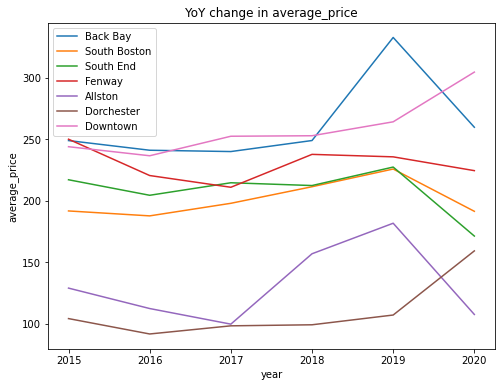

# Inside Airbnb: Understanding the effects of Airbnb on Communities

Team
Aditya Prasad
Ritika Gupta
 
## Abstract

We have been very curious about how the infiltration of Airbnb rentals is affecting our neighborhoods. Airbnb hosts can list entire homes/apartments, private or shared rooms. Depending on the room type, availability, and activity, an airbnb listing could be more like a hotel, disruptive for neighbors, taking away housing, and illegal. Airbnb guests may leave a review after their stay, and these can be used as an indicator of airbnb activity. The minimum stay, price and number of reviews have been used to estimate the occupancy rate, the number of nights per year and the income per month for each listing.

To understand this better. We are using the Inside Airbnb dataset which has been built over the years (Since 2015 - Present). This dataset gets scraped from the Airbnb website, and is regularly updated every month. The website entails data on listings, reviews, and bookings per neighbourhood for major cities.. For our analysis we have chosen to work with the Boston city dataset particularly the listings, neighbourhoods and the reviews data collected over the years. The analysis carried out can be broken down into two steps:

Firstly, we take the top neighbourhoods that showed the highest YoY change in revenue,  and try to get a better understanding of how Airbnb listings in these neighbourhoods have contributed to its economy, because of which the demand for these neighbourhoods have increased, which is reflected in the YoY change in rent for these neighbourhoods.

In the second step, we have taken the neighbourhoods that were considered as the poorest neighbourhoods in Boston according to the Boston Redevelopment Authority in 2014, and are currently well on their path to gentrification, and see how Airbnb listings may have had a hand in it. We gathered reviews on each of these neighbourhoods, calculated their sentiments and figured out how the perception of the neighbourhoods has changed over the years.

We start with initial exploration of the data, cleaning and preprocessing the data. We then go ahead comparing the number of listings YoY change and average_price YoY change for the neighbourhoods that saw the greatest YoY change in rent in Boston, and try to get a better understanding of how Airbnb listings in these neighbourhoods have contributed to its economy, because of which the demand for these neighbourhoods have increased, which is reflected in the YoY change in rent for these neighbourhoods.

Based on our analysis, the data from Airbnb reflects our hypothesis, that there is a positive relationship with YoY change in number_of_listings to YoY change in rent. Also we see that Airbnb's in a few areas, for example, Allston, have definitely contributed to the development of the area in terms of it improving as a community over the course of 5 years. The average renting rates have gone up, so have the number of listings. Another interesting note was that we also saw a dip from 2019 to 2020 for the number of listings, but we are chalking this anomaly as a result of COVID-19.
 
## Introduction

**What are we trying to solve?**
It is extremely interesting to see how a company like Airbnb can give people that platform to be able to rent out their unused living space and the ramifications of this on the areas where it occurs. We really want to dig deep to find out what is the truth behind Airbnb’s impact on our regions. Our speculation is that if the number of Airbnb listings in a region increases this leads to development within the area owing to the cash flow due to the listings as well as tourists/people exploring the areas near the Airbnbs.

**Why is it important to solve this problem?**
Insights from this study can help us understand how communities evolve overtime owing to increase in Airbnb listings within a region. Also, we can evaluate  the effects of a company on the neighbouring areas so we can use this information to educate the communities and people about it. 
This can help us understand how an area and community is affected by the Airbnb culture and show us the pros as well as cons to the introduction of tourists/travellers within a region due to Airbnb.  
 
**Background information and bit of literature survey to present what’s already known about this problem**
Studies have been conducted to find the solution to the bigger problem, http://insideairbnb.com/index.html. Through this project, we aim to find answers to how these listings have affected boston neighbourhoods.

## Methodology

To fully understand the impact of airbnb on these neighbourhoods, our solution is two folds. 
The first task would be an initial exploration of data based on neighbourhoods. Based on this link, https://bostonpads.com/2019-boston-apartment-rental-market-report/, we finalized the neighbourhoods that we would consider to these 7 neighbourhoods as they had the highest YoY change in rent in Boston, 

First we plan on getting the required listings data on each of these neighbourhoods, then using that data, calculate how the amount of listings and their prices have changed YoY. 
With this data, we hope to verify if Airbnb listings and their prices have been increasing in these neighbourhoods, which might have been one of the reasons for these neighbourhoods seeing the highest YoY increase in rent prices.

The second task involves getting a deeper analysis of three neighbourhoods(Fenway, Allston and Dorchester) that were considered as some of the poorest in 2014, by the Boston Redevelopment Authority, http://www.bostonplans.org/getattachment/f1ecaf8a-d529-40b6-a9bc-8b4419587b86
We chose these neighbourhoods, based on various articles we read on gentrification in Boston, https://www.bostonglobe.com/2020/07/10/metro/boston-is-third-most-intensely-gentrified-city-united-states-study-says/#:~:text=In%20Boston%2C%20gentrification%20occurred%20in,along%20the%20Interstate%2093%20corridor. 
And also our personal experience of experiencing these neighbourhoods.
Firstly, similar to the first task, we plan on calculating the number of listings and average price over the years in each of these neighbourhoods, with an extra caveat of calculating these fields for each room type as well.
Then we plan on getting the reviews of listings, and calculate the sentiment score of these reviews. We plan on dividing them according to room types and comparing them. With this analysis we hope to gain a better understanding of people’s sentiment towards these neighbourhoods, and particularly towards each room_types, and try to answer if people prefer Shared rooms to Private rooms or Entire homes.

## Code

We are using a docker image of a pyspark notebook to run our analysis. So the analysis is being run on Spark Dataframes and not pandas dataframes. 
First we analysed the neighbourhood data and shortlisted the neighbourhoods that we wanted. Then we ran a summary analysis on each of these neighbourhoods, where in, we got the listings data, filtered it out to only contain the top neighbourhoods. On this data we ran a spark sql query to aggregate the number of listings and average price of listings in each neighbourhood, and plotted a line graph, which visualized how the number of listings and average price has changed over the years in each of these neighbourhoods.
Before diving into a detailed summary of each neighbourhood, we joined the listings, reviews and the neighbourhoods data. We performed left-semi join on listings data and neighbourhoods data, which got us the listings data for only the neighbourhoods that we desired. On the resulting dataframe we performed inner join with the reviews dataset, to match the listings to its reviews. 
Then for each neighbourhood data, we noticed that few reviews were in different languages, so using textblob python library, we translated all the reviews to english. Then for each review we calculated its polarity using textblob’s sentiment functionality. We then aggregated the polarity across different room types in each of the neighbourhoods. We then visualized the data using histograms, which showed the sentiment towards each room type in the neighbourhoods.

## How To Run

**Detailed Instructions:** 

Below we have given detailed steps on how to get our code up and running
It is important to have docker installed, you can verify if you have docker installed by running docker command on the terminal, if docker is already installed, then a list of options will show up. If docker is not installed, you can get it from here, https://docs.docker.com/get-docker/
Once you have verified that docker is installed, run the below command on the terminal, 

> docker run -it --rm -p 8888:8888 jupyter/pyspark-notebook
	
It will install the docker image locally, this will only happen the first time you run the command. You can verify that its successful, if at the end it shows something like this, 

    To access the notebook, open this file in a browser:
        file:///home/jovyan/.local/share/jupyter/runtime/nbserver-6-open.html
    Or copy and paste one of these URLs:
        http://b2f15138b338:8888/?token=2be13ae6c75324135cb7881ac09dc0d9513f0b3c79126123
     or http://127.0.0.1:8888/?token=2be13ae6c75324135cb7881ac09dc0d9513f0b3c79126123

The last url is what concerns us, do not exit the terminal, just copy the last url(one starting with  http://127.0.0.1:8888/?token=) and paste it on your browser. Please note that your url will be different, as the token generated will be different each time, so make sure to copy the url generated in your terminal, and not this one.

On the browser tab, jupyter home directory will be opened showing only one directory in it (work directory). 
On the top right hand side, on top of the directory grid, you will see two options, Upload and New. Click on new, a list of options will open, select Terminal as the option, and the terminal tab will open in a new tab
In the terminal window of docker, first fetch the project from github, using the below command, 

git clone https://github.com/aditya-prasad-projects/Airbnb.git

Wait till it finishes running.
      
Once its downloaded everything, run the below command in the terminal 

>pip install -r requirements.txt

It will download the textblob library, which is required by our project to calculate sentiment scores for reviews.
You can also make it work using

				pip install textblob

If you come back to the main jupyter page, you can see a directory named as Airbnb (along with the work directory already present), open the directory, it will have two .ipynb files, Boston_Airbnb_Analysis_Detailed.ipynb and Boston_Airbnb_Analysis_Summary.ipynb. 
Open the run the two files to view the project.

Brief Instructions:
Ensure docker is installed and run, 
	docker run -it --rm -p 8888:8888 jupyter/pyspark-notebook
Copy paste the url it generated in the browser, jupyter home will open up, top right hand side, click on new, list of option will be displayed, click on terminal. 
On terminal of docker, fetch the project from github, using
	git clone https://github.com/aditya-prasad-projects/Airbnb.git
And install the required textblob library,
	pip install textblob
On the jupyter home page, Airbnb directory would have been created, open it, it will contain two .ipynb files, run both to view the output.

**(Please refer Detailed instructions if stuck anywhere)

## Dataset

The link, http://insideairbnb.com/get-the-data.html has all the latest scraped data from airbnb.
The dataset is partitioned by city. So we plan on running initial diagnostics on the boston dataset for each year from 2015 to present.
Each city has the following data available,

Listings.csv:
root
 |-- id: string (nullable = true)
 |-- name: string (nullable = true)
 |-- host_id: string (nullable = true)
 |-- host_name: string (nullable = true)
 |-- neighbourhood_group: string (nullable = true)
 |-- neighbourhood: string (nullable = true)
 |-- latitude: string (nullable = true)
 |-- longitude: string (nullable = true)
 |-- room_type: string (nullable = true)
 |-- price: string (nullable = true)
 |-- minimum_nights: string (nullable = true)
 |-- number_of_reviews: string (nullable = true)
 |-- last_review: string (nullable = true)
 |-- reviews_per_month: string (nullable = true)
 |-- calculated_host_listings_count: string (nullable = true)
 |-- availability_365: string (nullable = true)

Reviews.csv
root
 |-- listing_id: string (nullable = true)
 |-- id: string (nullable = true)
 |-- date: string (nullable = true)
 |-- reviewer_id: string (nullable = true)
 |-- reviewer_name: string (nullable = true)
 |-- comments: string (nullable = true)

Neighbourhoods.csv
root
 |-- neighbourhood_group: string (nullable = true)
 |-- neighbourhood: string (nullable = true)

## Results and Discussion

The results that we have are represented by the graphs and detailed discussions about them below.
We plotted the following graphs for the neighbourhoods:
 

>Figure 1: number_of_listings overtime per neighbourhood

>Figure 2: average_price overtime per neighbourhood

The analysis of Figure 1; the line indicates the number_of_listings YoY change and Figure 2; line indicates the average price YoY change, shows that for each neighbourhood, the number of listings metric and average price for listings in that neighbourhood took a dive from 2019 to 2020. We are charting this anomaly in comparison to the upward trends that we saw in other years to COVID-19. Further analysis of the plots of each neighbourhood shows that, the number of listings has increased in each of the neighbourhoods YoY, which might be one of the reasons for highest YoY rent increase in these neighbourhoods, as the analysis done by Airbnb shows that people contribute to the increase in the neighbourhoods economy when they stay in their listings. And it is clearly visible that there is a correlation between the number of listings and the increase of the prices.

Below we will talk about the 3 neighborhoods Allston, Dorchester and Fenway with respect to their room type and the number of listings and the average pricing for each of them.

>Figure 3: Average Price wrt Room Type in Allston 

>Figure 4: No. of listings wrt Room Type in Allston

>Figure 5: Average Price wrt Room Type in Dorchester 

>Figure 6: No. of listings wrt Room Type in Dorchester

In Figure 5 and 6 we can see correlation of the prices of the Airbnb listings increasing as the number of listings also increase. This shows that the area attracts more tourists and travellers and encourages them to rent out Airbnbs and hence improving cash flow as well as the neighbour’s rating.
In Allston as well as Dorchester we can see that people prefer renting the Private room as that has the maximum listings also, and it can also be noted that shared rooms are least preferred.  

>Figure 7: Average Price wrt Room Type in Fenway 

>Figure 8: No. of listings wrt Room Type in Fenway

Whereas in Fenway we see a trend of renting out complete apartments. Also a very interesting note is that the rental price of shared spaces increases sharply in Fenway. 

Below we have 3 graphs showing the polarity of the room rentals via Airbnb according to the room type in the Fenway region of Boston. We have the number of reviews on the y axis and the review polarity on the x axis for all three room types.

>Figure 9: Review polarity for Entire home/apt 

>Figure 10:Review polarity for Private Room 

>Figure 11:Review polarity for Shared 

Interpreting graphs 9,10 and 11 we can notice that the Graphs 9 and 11 show a higher sentiment score by their renter i.e complete apartments and shared rooms receive better review than private room Airbnb listings.

Below we have 3 graphs showing the polarity of the room rentals via Airbnb according to the room type in the Allston region of Boston.

>Figure 12: Review polarity for Entire home/apt 

>Figure 13:Review polarity for Private Room 

>Figure 14:Review polarity for Shared 

Interpreting graphs 12,13 and 14 we can notice that the Graph 14 show a higher sentiment score by their renter i.e shared rooms receive better review than private room or entire housing Airbnb listings.

Below we have 3 graphs showing the polarity of the room rentals via Airbnb according to the room type in the Dorchester region of Boston.

>Figure 15: Review polarity for Entire home/apt 

>Figure 16:Review polarity for Private Room 

>Figure 17:Review polarity for Shared 

Interpreting graphs 15,16 and 17 we can notice that the Graph 15 and 16 show a higher sentiment score by their renter i.e entire apartments and private rooms receive better review than shared room Airbnb listings.

## Future Work

For Future work, we hope to build a better pipeline, to make it easier for anyone to run analytics on their neighbourhood data from InsideAirbnb using cloud technologies. Partly to help this, we have used spark to code and not used pandas, since spark can be scaled easily.
We plan on building a data pipeline that can be maintained using Apache Airflow, this will have scripts to query InsideAirbnb data for each city, load them into S3 buckets, from which it will be uploaded to Redshift for querying and analysis, or one can use Amazon Athena to query the bucket directly. The script can run on a schedule, to keep updating the bucket as and when data gets scraped and put into InsidAirbnb.
Conclusion

We believe we achieved what we set out to, with this project. Using our two fold solution described in the methodology, we have gained a better understanding of how a company like Airbnb can give people that platform to be able to rent out their unused living space and the ramifications of this on the areas where it occurs. Few interesting facts that came up were the effect of COVID-19 on the listings in Boston, the rise in number of listings and average price over the years, and the general sentiment of travelers towards the listing and the neighbourhood in general. 

## References

http://insideairbnb.com/get-the-data.html
https://bostonpads.com/2019-boston-apartment-rental-market-report/
http://insideairbnb.com/index.html
https://medium.com/@suci/running-pyspark-on-jupyter-notebook-with-docker-602b18ac4494
http://www.bostonplans.org/getattachment/f1ecaf8a-d529-40b6-a9bc-8b4419587b86

